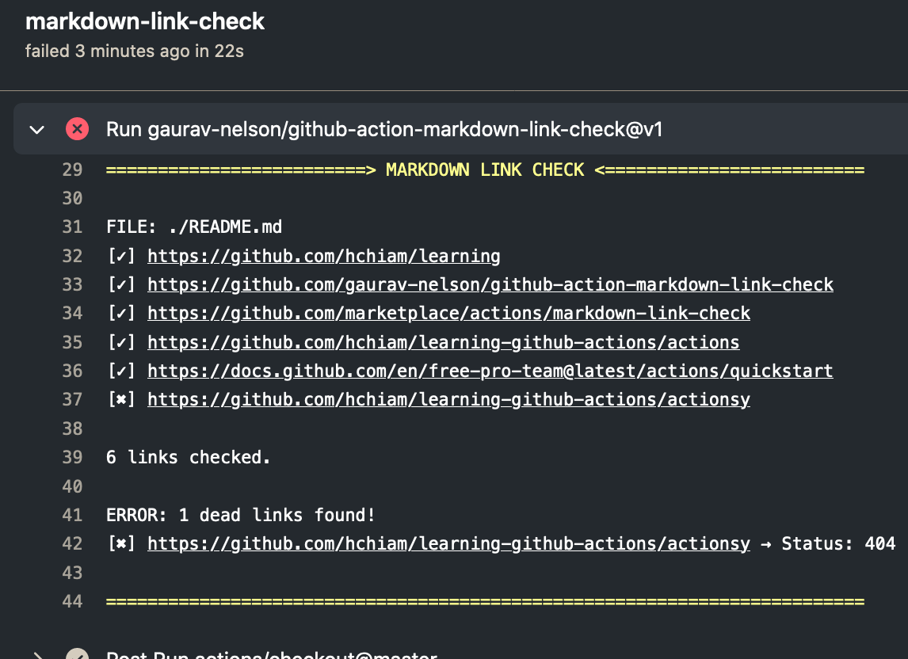

# Learning GitHub Actions

Just one of the things I'm learning. <https://github.com/hchiam/learning>

Testing out `markdown-link-check` on this repo:

<https://github.com/gaurav-nelson/github-action-markdown-link-check>

<https://github.com/marketplace/actions/markdown-link-check>

## Setup

```bash
mkdir .github && mkdir .github/workflows && touch .github/workflows/action.yml
```

Then edit `action.yml`

When you push, you'll see results here: <https://github.com/hchiam/learning-github-actions/actions>

More info: <https://docs.github.com/en/free-pro-team@latest/actions/quickstart>

Intentionally broken link: <https://github.com/hchiam/learning-github-actions/actionsy>

## Example output

Successfully detected broken link in `README.md`!



## Learn more

<https://docs.github.com/en/actions/quickstart>

<https://docs.github.com/en/actions/reference/events-that-trigger-workflows>

<https://github.com/marketplace/actions/cypress-io>

## Replace Travis CI with GitHub Actions

```yml
name: GitHub Actions Demo

on:
  [pull_request]
  types: [review_requested]

jobs:
  Example-GitHub-Action-Name:
    runs-on: ubuntu-latest
    steps:
      - name: Checkout
        uses: actions/checkout@v2 # this will use https://github.com/actions/checkout
      - name: Cypress run
        uses: cypress-io/github-action@v2 # this will use https://github.com/cypress-io/github-action
```
